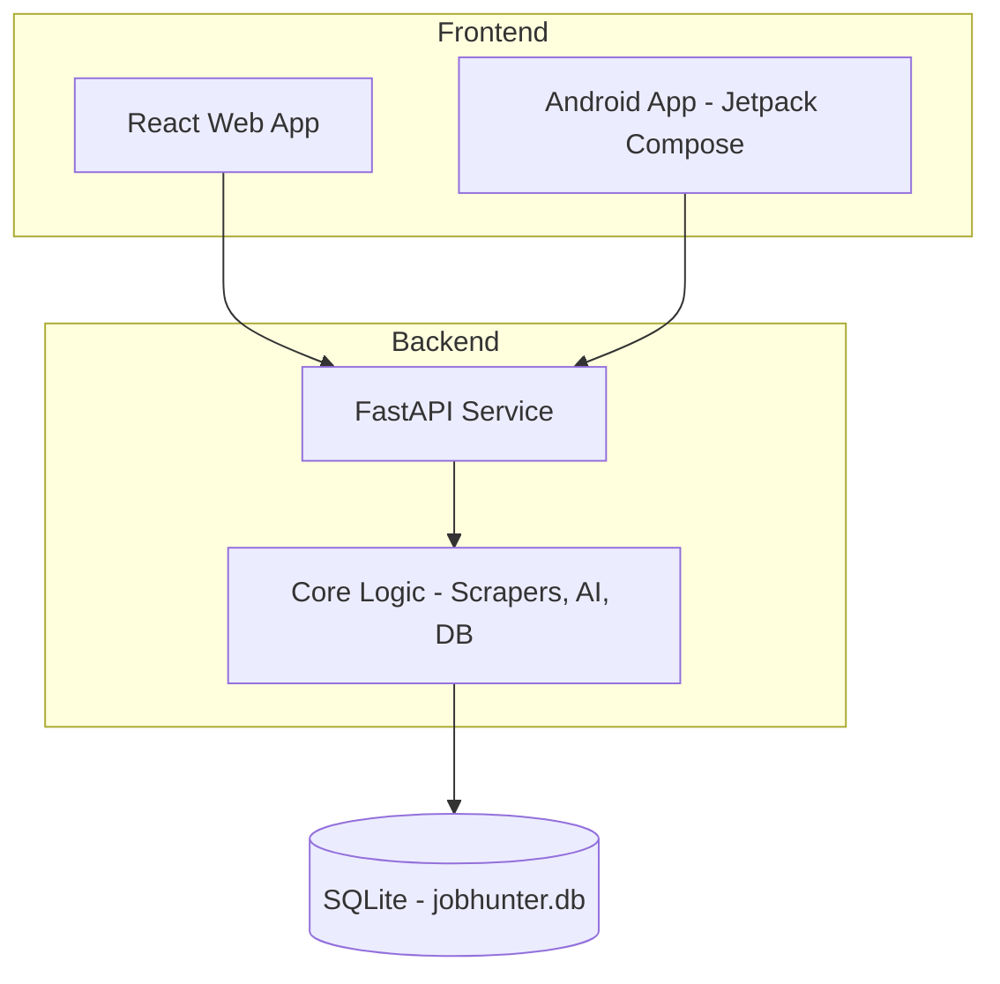

# JobHunterAI Ecosystem 🚀

JobHunterAI is a production-grade, local-first job tracking and discovery ecosystem. It features a high-performance Python backend, a modern React web application, and a native Android application.

---

## 🏗 Architecture Overview



### Key Modules:
- **`backend/`**: Unified FastAPI service providing REST endpoints for Web and Mobile.
- **`core/`**: The brain of the system. Handles multi-site scraping, AI match analysis, and data persistence.
- **`src/`**: React application built with Vite and Tailwind CSS.
- **`mobile/android/`**: Native Android application engineered with Kotlin and Jetpack Compose.

---

## 🛠 Tech Stack

- **Backend**: Python 3.11+, FastAPI, SQLAlchemy, Playwright.
- **AI**: Google Gemini & Groq (with local heuristic fallbacks).
- **Web**: React 18, Vite, Tailwind CSS, Lucide.
- **Mobile**: Kotlin, Jetpack Compose, Material 3, Retrofit.
- **Infrastructure**: Docker, Docker Compose, GitHub Actions.

---

## 🚀 Quick Start

### 1. Prerequisites
- Python 3.11+
- Node.js 20+
- Android Studio (for mobile development)
- Docker (optional)

### 2. Local Setup (Development)

#### Backend (FastAPI)
```bash
# Set PYTHONPATH to include the core module
$env:PYTHONPATH="core" 
pip install -r requirements.txt
python -m playwright install chromium
python backend/main.py
```

#### Web (Vite)
```bash
npm install
npm run dev
```

#### Android (Gradle)
1. Open `mobile/android` in Android Studio.
2. Build and run the `:app` module.

### 3. Docker Deployment
```bash
docker-compose up --build
```

---

## 🔍 Features & Policies

- **Local-First**: All job data and resume profiles are stored in a local SQLite database.
- **Offline Fallback**: If LLM API keys are missing, the system uses technical keyword intersection to provide match scores.
- **Privacy Driven**: Your resume and job history never leave your machine unless specifically sent to an LLM for analysis.

---

## 🤝 Contribution & License
- Branching Strategy: `refactor/modular-core-architecture`, `feature/web-app-ready`, `feature/android-app-ready`.
- Licensed under the **MIT License**.
