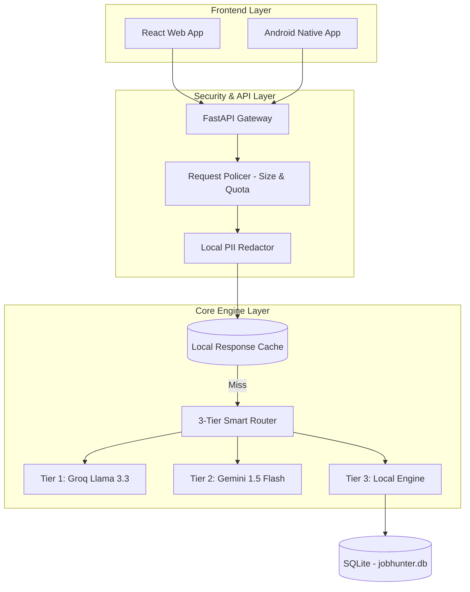

# JobHunterAI Ecosystem v3.0 🚀

JobHunterAI is an elite, local-first job tracking and career automation ecosystem. It features a high-performance Python backend with a 3-tier fallback AI router, a modern React web application, and a native Android application.

---

## 🏗 Architecture Overview



---

## 🛠 Features

1.  **3-Tier Smart Router**: Cascading fallback logic (Groq -> Gemini -> Local Engine) with built-in circuit breakers and **exponential backoff**.
2.  **Quota Safeguards**: Automatic detection of API exhaustion with immediate failover to Tier 3.
3.  **Response Caching**: Identical career queries are served from a local cache to save tokens and minimize latency.
4.  **Zero-Trust Privacy**: Local PII Redaction masks emails, phones, and addresses before cloud processing.
5.  **Multi-Platform**: Seamless experience across Web and Native Android.
6.  **Offline First**: Semantic matching works locally using Sentence-Transformers even without API keys.

---

## 🚀 Quick Start

### 1. Prerequisites
- Python 3.11+
- Node.js 20+
- Android Studio (Electric Eel or newer)
- Docker (Optional)

### 2. Local Setup

#### Backend (FastAPI)
```bash
# Set PYTHONPATH to the core logic
$env:PYTHONPATH="core" 
pip install -r requirements.txt
python -m playwright install chromium
python backend/main.py
```

#### Web (Vite)
```bash
npm install
npm run dev
```

#### Android (Gradle)
1. Open `mobile/android` in Android Studio.
2. Build and run the `:app` module.

### 3. Docker Deployment
```bash
docker-compose up --build
```

---

## 🔒 Environment Variables (`.env`)
```env
# AI Providers
GROQ_API_KEY=your_key
GEMINI_API_KEY=your_key
AI_PROVIDER=groq

# Local Config
DATABASE_URL=sqlite:///./data/jobhunter.db
APIFY_API_TOKEN=your_token
```

---

## 🤝 License
Released under the **MIT License**.
