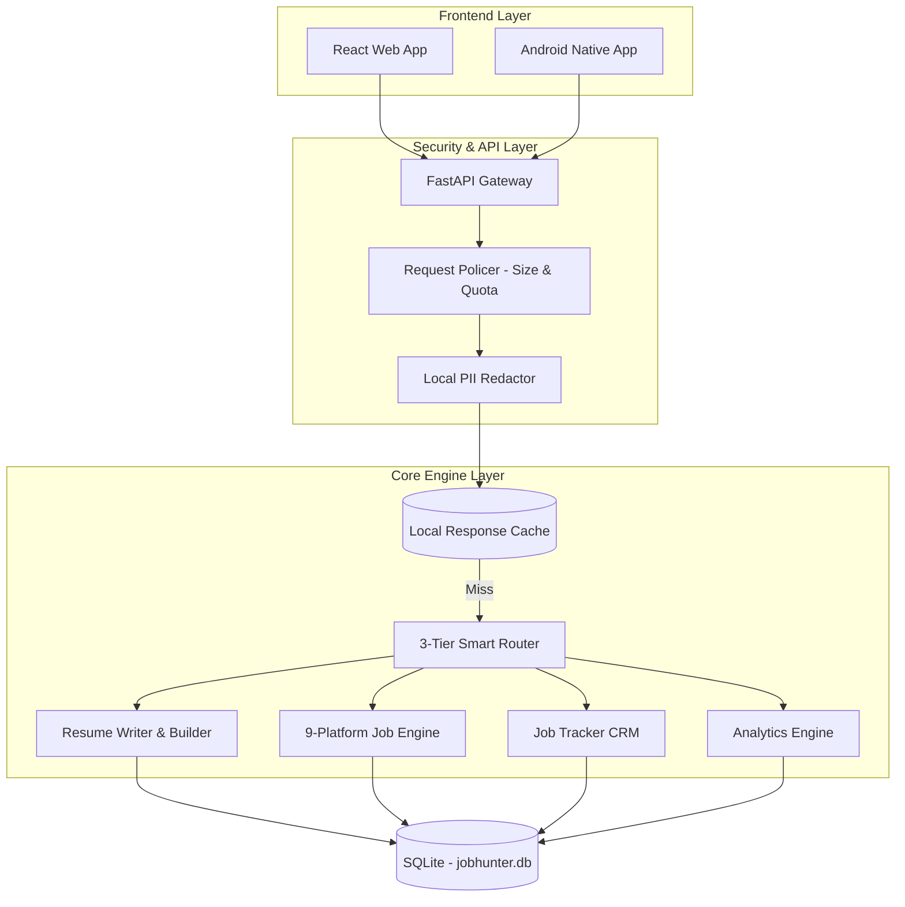

# JobHunterAI Ecosystem v3.0 🚀

JobHunterAI is an elite, local-first job tracking and career automation ecosystem. It features a high-performance Python backend with a 3-tier fallback AI router, a modern React web application, and a native Android application.

---

## 🏗 Architecture Overview



---

## 🛠 Features

1.  **3-Tier Smart Router**: Cascading fallback logic (Groq -> Gemini -> Local Engine) with built-in circuit breakers and **exponential backoff**.
2.  **Enterprise Resume Suite**: side-by-side JD analysis, AI bullet point tailoring, and 4 high-fidelity ATS templates (PDF/DOCX export).
3.  **9-Platform Job Discovery**: Aggregated live feeds from LinkedIn, Indeed, Glassdoor, ZipRecruiter, Google Jobs, Dice, Monster, SimplyHired, and Working Nomads.
4.  **Application Tracker CRM**: Drag-and-drop Kanban board for managing your job search pipeline.
5.  **Career Analytics**: Conversion tracking, application velocity, and skill gap visualization.
6.  **Zero-Trust Privacy**: Local PII Redaction masks sensitive data before any cloud processing.
7.  **Multi-Platform**: Native experience across Web (React) and Android (Jetpack Compose).

---

## 🚀 Quick Start (Enterprise Edition)

### 1. Prerequisites
- **Python 3.11+**
- **Node.js 22+**
- **Android Studio** (for mobile deployment)
- **Groq & Gemini API Keys** (Optional for offline mode)

### 2. Implementation & Setup

#### Core & Backend
```bash
# Set PYTHONPATH to include core logic
$env:PYTHONPATH=".;core" 

# Install dependencies
pip install -r requirements.txt

# Start FastAPI Gateway
python backend/main.py
```

#### Web Dashboard
```bash
npm install
npm run dev
```

#### Android Native
1. Open `mobile/android` in Android Studio.
2. Build and run `:app` on your device/emulator.

---

## 🛡️ Zero-Trust Privacy & Resilience

JobHunterAI Pro is designed to never fail a user request due to API exhaustion. You can verify the 3-tier logic with these steps:

1. **Tier 1 (Groq)**: Set `GROQ_API_KEY` and perform a match. Look for the Green ⚡ chip.
2. **Tier 2 (Gemini)**: Unset `GROQ_API_KEY`, set `GEMINI_API_KEY`. Look for the Purple 🧠 chip.
3. **Tier 3 (Local)**: Unset both keys. The system will use `sentence-transformers` locally. Look for the Slate 💻 chip.
4. **Caching**: Perform the same match twice. The second response will be near-instant and marked with `local_cache`.

---

## 🔒 Environment Variables (`.env`)
```env
# AI Providers
GROQ_API_KEY=your_key
GEMINI_API_KEY=your_key
AI_PROVIDER=groq

# Local Config
DATABASE_URL=sqlite:///./data/jobhunter.db
APIFY_API_TOKEN=your_token
```

---

## 🤝 License
Released under the **MIT License**.
