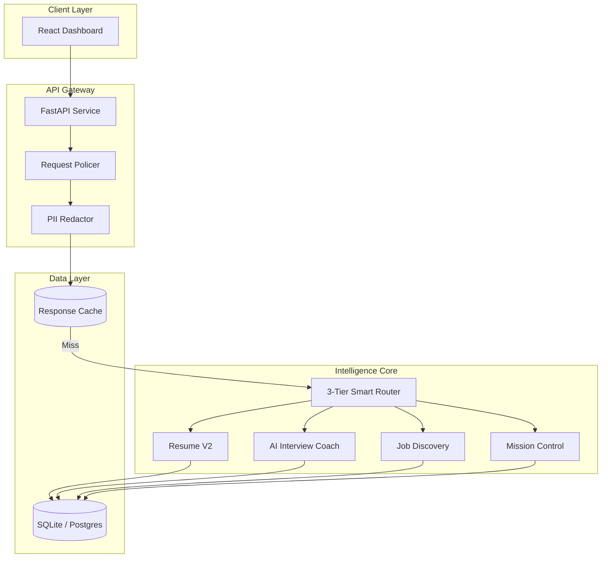

# JobHunterAI 🚀
### Elite AI-Powered Career Automation & Job Search Intelligence

[](https://github.com/your-org/JobHunterAI/releases)
[](https://opensource.org/licenses/MIT)
[](https://www.python.org/downloads/)
[](https://nodejs.org/)

**JobHunterAI** is a production-grade, local-first ecosystem designed to automate the modern job search. By leveraging a high-performance Python backend with a multi-tier AI fallback router and a modern React frontend, it provides job seekers with enterprise-level tools for resume optimization, job discovery, and application tracking.

---

## 🏗 Architecture Overview

JobHunterAI follows a clean, modular architecture designed for resilience and privacy.

### AI Multi-Tier Routing
The system implements a verified **3-Tier Routing** logic:
1.  **Tier 1 (Groq)**: Ultra-fast Llama 3.3 for real-time tailoring.
2.  **Tier 2 (Gemini)**: High-reasoning 1.5 Flash for complex context.
3.  **Tier 3 (Local)**: Sentence-Transformers or Ollama for privacy and offline fallback.

### Dynamic Scraper Registry
Utilizes a YAML-based registry (`config/apify_actors.yaml`) to manage a fleet of Apify actors (LinkedIn, Indeed, Google Jobs) with automated health monitoring and priority-based selection.


```mermaid
graph TD
    subgraph Client Layer
        Web[React Dashboard]
    end

    subgraph API Gateway
        FastAPI[FastAPI Service]
        Policer[Request Policer]
        Sanitizer[PII Redactor]
    end

    subgraph Intelligence Core
        Router[3-Tier Smart Router]
        ResumeEngine[Resume V2]
        Coach[AI Interview Coach]
        ScraperFleet[Job Discovery]
        Analytics[Mission Control]
    end

    subgraph Data Layer
        Cache[(Response Cache)]
        DB[(SQLite / Postgres)]
    end

    Web --> FastAPI
    FastAPI --> Policer
    Policer --> Sanitizer
    Sanitizer --> Cache
    Cache -- Miss --> Router
    Router --> ResumeEngine & Coach & ScraperFleet & Analytics
    ResumeEngine & Coach & ScraperFleet & Analytics --> DB
```

---

## ✨ Key Features

- **3-Tier Smart AI Router**: Dynamically routes tasks based on capability and health. Supports `auto` mode to automatically switch between Groq, Gemini, and local models.
- **AI Interview Coach**: Practice mock interviews with real-time scoring and STAR method guidance grounded in your resume.
- **Production Resume Builder**: Multi-document management with 10 professional A4 templates and high-fidelity PDF/DOCX exports.
- **Recruiter CRM**: Discover Hiring Managers and Recruiters via live intelligence and manage outreach history.
- **Intelligent Job Discovery**: Aggregated live job feeds from LinkedIn and Glassdoor with automated deduplication and AI enrichment.
- **Unified Mission Control**: Career dashboard with chronological timelines, success rates, and skill-gap radar.
- **Zero-Trust Privacy**: Integrated PII redactor masks sensitive data locally before any cloud processing.

---

## 🚀 Quick Start

### 1. Prerequisites
- **Python 3.11+**
- **Node.js 22+**
- **PostgreSQL** (Optional, defaults to SQLite)
- **External Services**: [Groq](https://groq.com/) (Recommended), [Apify](https://apify.com/) (For cloud scraping)

### 2. Installation

```bash
# Clone the repository
git clone https://github.com/your-org/JobHunterAI.git
cd JobHunterAI

# Setup Backend
python -m venv venv
source venv/bin/activate # Windows: venv\Scripts\activate
pip install -r backend/requirements.txt
python -m playwright install chromium

# Setup Frontend
cd frontend
npm install
npm run build
cd ..
```

### 3. Configuration
Copy `.env.example` to `.env` and fill in your API keys:
```bash
cp .env.example .env
```

| Variable | Default | Description |
| :--- | :--- | :--- |
| `ENVIRONMENT` | `development` | `development`, `production`, `testing`, `staging` |
| `PORT` | `8000` | API server port |
| `AI_PROVIDER` | `auto` | Primary AI engine (`auto`, `groq`, `gemini`, `openai`, `ollama`) |
| `GROQ_API_KEY` | - | Required for Tier 1 inference |
| `GEMINI_API_KEY` | - | Required for Tier 2 inference |
| `DATABASE_URL` | `sqlite+aiosqlite:///./jobhunter.db` | SQLAlchemy connection string |
| `APIFY_API_TOKEN` | - | Required for premium job board scraping |
| `CORS_ORIGINS` | `*` | Allowed origins (CSV or JSON array) |

For production, set `ENVIRONMENT=production` and specify explicit `CORS_ORIGINS`.

### 4. Run the Application
```bash
# Start Backend
python backend/main.py

# Start Frontend (in separate terminal)
cd frontend
npm run dev
```

---

## 🛠 Project Management

### Database Migrations
We use Alembic for version-controlled schema updates:
```bash
cd backend
$env:PYTHONPATH="..;../core" # Windows
python -m alembic upgrade head
```

### Running Tests
```bash
$env:PYTHONPATH=".;core"
python -m pytest tests/unit tests/application
```

### Docker Deployment
```bash
docker-compose up --build -d
```

---

## 📂 Folder Structure

- `backend/`: FastAPI routers and API entry points.
- `frontend/`: React components and dashboard UI.
- `core/`: Business logic, AI engine, and database infrastructure.
- `domain/`: Pure domain entities and value objects.
- `application/`: Use cases and orchestration services.
- `docs/`: Technical guides and architecture records.
- `tests/`: Multi-level test suite (Unit, Integration, E2E).

---

## 📖 Documentation
- [Architecture Guide](docs/Architecture.md)
- [API Specification](docs/API.md)
- [Configuration Manual](docs/Configuration.md)
- [Deployment Runbook](docs/Deployment.md)

---

## 🛠 Technology Stack

- **Backend**: FastAPI, SQLAlchemy 2.0, Pydantic, Alembic
- **Frontend**: React 18, TypeScript, Tailwind CSS, Lucide React
- **AI/ML**: Groq (Llama 3.3), Google Gemini, Ollama, Sentence-Transformers
- **Data**: PostgreSQL, SQLite, Pandas
- **Export**: Playwright (PDF), python-docx, Markdown

---

## 🤝 Contributing
Contributions are welcome! Please read the [Contributing Guide](CONTRIBUTING.md) before submitting a Pull Request.

---

## 📄 License
This project is licensed under the **MIT License** - see the [LICENSE](LICENSE) file for details.

---

## 🆘 Support & Troubleshooting
If you encounter issues, check the [Support Guide](SUPPORT.md) or open a GitHub Issue.
- **Port Conflict**: Change `PORT` in `.env` if 8000 is occupied.
- **AI Failures**: Verify your API keys in `.env`.
- **Scraper Errors**: Ensure `playwright` is installed via `python -m playwright install`.
